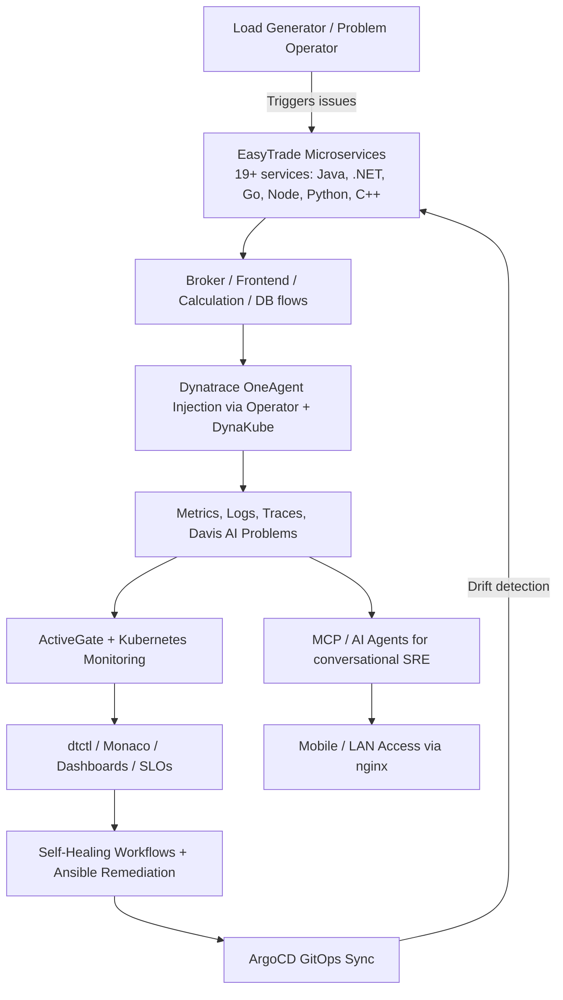

# EasyTrade Observability Portfolio

**Production-grade Dynatrace monitoring and automation for a polyglot Kubernetes microservices application**

This repository contains a complete, reproducible observability implementation using Dynatrace on the EasyTrade microservices demo application. It demonstrates real-world patterns for instrumentation, declarative configuration, self-healing automation, accessible demo environments, and GitOps.

## Architecture

EasyTrade is a realistic polyglot microservices application consisting of 19+ services implemented in Java/Spring, .NET, Go, Node.js/TypeScript, Python, and C++. It includes a load generator and problem operator to produce authentic traces, metrics, logs, and Davis AI problems.

The stack is deployed as follows:

- **Application Deployment**: Official Helm chart (`oci://europe-docker.pkg.dev/dynatrace-demoability/helm/easytrade` v1.5.2) into the `easytrade` namespace on a kind cluster (`dt-homelab`).
- **Observability Integration**: Dynatrace Operator (Helm) with a DynaKube custom resource configured for `applicationMonitoring` mode. This enables automatic code module injection for all supported languages without requiring full host agents.
- **Kubernetes Visibility**: ActiveGate with kubernetes-monitoring enabled for cluster registration and infrastructure metrics.
- **Network Exposure**: Custom kind configuration with extra port mappings + nginx ingress controller. The main UI is reachable at `http://localhost:8081` (or LAN IP) without port-forwarding.
- **Mobile Accessibility**: nginx ingress annotations inject responsive CSS for better experience on phones (scrollable tables, larger touch targets).

This setup generates genuine monitoring data suitable for exercising Dynatrace features including Smartscape, Davis root cause analysis, DQL, SLOs, and workflow automation.

### Architecture Diagram



See `docs/easytrade-problems-and-remediation.md` for detailed flows and `gitops/` for ArgoCD manifests.

## Skills Demonstrated

This project exercises capabilities commonly required in senior observability, SRE, and platform engineering roles:

- End-to-end Kubernetes application monitoring with Dynatrace Operator and DynaKube
- Declarative management of dashboards, SLOs, and automation using dtctl
- Design and implementation of self-healing workflows triggered by real problems
- Custom DQL development and dashboard construction for multi-service applications
- Scripting and API automation against the Dynatrace platform
- Infrastructure-as-code patterns (Terraform provider, Monaco / config-as-code)
- Model Context Protocol (MCP) integration for connecting observability data to external agents
- Practical environment design for reliable local and LAN-based testing (including mobile)
- Agent deployment automation (Ansible roles/playbooks for OneAgent and ActiveGate)
- Host-level operations and troubleshooting tied directly to observability signals (Linux + Windows)
- GitOps deployments with ArgoCD for declarative K8s + observability stacks

This repo follows patterns from the official Dynatrace tooling ecosystem (dynatrace-operator, monaco, dtctl, dynatrace-mcp), demonstrating applied skills on a real microservices workload.

## Project Structure

- `k8s/` — kind cluster configuration, DynaKube definition, and ingress manifests (with mobile CSS injection)
- `gitops/` — ArgoCD Application manifests for GitOps (Operator + EasyTrade)
- `scripts/` — `setup-homelab.sh` (full reproducible deployment) and `apply-easytrade-automation.sh`
- `automation/easytrade-self-healing/` — Source definitions for three Dynatrace workflows
- `dashboards/` and `monaco/` — Declarative dashboard, SLO, and configuration assets
- `api-examples/` — Python and shell examples for interacting with Dynatrace data and resources
- `dql-examples/` — Curated DQL queries scoped to the easytrade namespace
- `docs/` — Detailed documentation including problems and remediation
- `terraform-examples/` — Terraform configuration using the Dynatrace provider
- `mcp-examples/` — Guidance and prompts for connecting Dynatrace data to external AI agents via MCP
- `ansible/` — Roles and playbooks for OneAgent/ActiveGate (roles structure aligned with official)

## Reproducible Setup

```bash
export PATH=~/.local/bin:$PATH
git clone https://github.com/entropicsage/dynatrace-portfolio.git
cd dynatrace-portfolio

# 1. Create the kind cluster with network exposure
kind get clusters | grep -q dt-homelab || kind create cluster --name dt-homelab --config k8s/kind-config.yaml --wait 5m

# 2. Deploy EasyTrade
helm install easytrade oci://europe-docker.pkg.dev/dynatrace-demoability/helm/easytrade \
  --create-namespace --namespace easytrade --kube-context kind-dt-homelab || \
  helm upgrade --install easytrade oci://europe-docker.pkg.dev/dynatrace-demoability/helm/easytrade \
     --namespace easytrade --kube-context kind-dt-homelab

# 3. Install Dynatrace Operator and apply DynaKube
helm install dynatrace-operator dynatrace/dynatrace-operator \
  --namespace dynatrace --create-namespace --kube-context kind-dt-homelab || true

# Create a PaaS + Kubernetes monitoring token in the Dynatrace UI, then:
kubectl create secret generic dynatrace --from-literal=apiToken=YOUR_TOKEN -n dynatrace --context kind-dt-homelab
kubectl apply -f k8s/dynakube.yaml --context kind-dt-homelab

# 4. Restart pods to trigger code module injection
kubectl delete pods -n easytrade --all --context kind-dt-homelab || true

# 5. Apply declarative dashboards and SLOs
dtctl apply -f dashboards/ --context my-env

# 6. Enable snippet support and deploy ingress for network access
kubectl patch deployment ingress-nginx-controller -n ingress-nginx --context kind-dt-homelab --type='json' \
  -p='[{"op":"add","path":"/spec/template/spec/containers/0/args/-","value":"--enable-snippet-annotations=true"}]'
kubectl rollout restart deployment ingress-nginx-controller -n ingress-nginx --context kind-dt-homelab
kubectl apply -f k8s/easytrade-ingress.yaml --context kind-dt-homelab
```

**Note on tokens**: Use a dedicated token with "PaaS integration" and "Kubernetes monitoring" scopes for the Operator. The dtctl context uses a separate read/write token.

For GitOps alternative: See `gitops/` and apply ArgoCD Applications.

## Access

The EasyTrade UI is available at:

- WSL / localhost: http://localhost:8081
- Windows host: http://YOUR_WSL_IP:8081 (or your WSL IP)
- LAN (other devices): Use Windows port proxy + firewall rule, then access via your Windows machine's LAN IP on port 8081

Login: `demouser` / `demopass`

### Mobile Testing

The ingress configuration includes CSS overrides for better rendering on small screens. Hard refresh after the controller restarts. Landscape orientation is recommended.

## Self-Healing Automation

Three Dynatrace workflows are defined that automatically remediate issues detected by Davis:

- **Broker Self-Healing** (`0b71092c-9235-4b37-aa4d-fe3ca90c19f3`): Restarts the broker deployment on problem detection and validates via SLO.
- **Frontend & ContentCreator Self-Healing** (`6e1d4232-fb4a-4c14-997c-33b1ec78f000`): Restarts frontend and scales contentcreator as needed.
- **General Remediation**: Broad trigger for EasyTrade problems with logging and targeted restarts.

Workflow definitions live in `automation/easytrade-self-healing/`. Apply them with `./scripts/apply-easytrade-automation.sh`.

**Hybrid approach with Ansible**:

Native Dynatrace Workflows provide fast K8s actions. For host-level, disk, or more complex remediation, use the Ansible playbooks in `ansible/playbooks/remediation/` (e.g. `remediate-disk-space.yml`, `remediate-easytrade-k8s.yml`, and the `self-heal-dispatcher.yml` that routes based on problem context).

These can be invoked from Dynatrace workflows via HTTP/webhook or a runner script that passes problem details as extra-vars.

Problems generated by the problem-operator will trigger these workflows in real time. Ansible remediation adds another layer for full-stack self-healing.

## GitOps with ArgoCD

To demonstrate modern declarative deployment practices, this portfolio includes ArgoCD examples.

See `gitops/README.md` and `gitops/applications/` for:

- `dynatrace-operator.yaml` — Operator deployment
- `easytrade.yaml` — Official Helm chart via OCI

**Benefits**:
- Git as source of truth.
- Automated sync, drift detection, self-heal, prune.
- Complements DT workflows + Ansible.
- Aligns with common enterprise Dynatrace + Kubernetes patterns.

Apply manifests or point ArgoCD at the gitops path in this repo. Changes sync automatically.

## Evidence and Validation

This portfolio generates real, verifiable observability data. To validate the setup:

1. Deploy using `scripts/setup-homelab.sh` and access the EasyTrade UI
2. Observe Davis AI problems generated by the problem-operator and loadgen
3. Inspect distributed traces across the polyglot service mesh
4. Watch self-healing workflows trigger and remediate automatically
5. Query dashboards and SLOs via `dtctl` or the Dynatrace UI

See `docs/easytrade-problems-and-remediation.md` for specific DQL queries, problem flows, and remediation details.

## DevOps & Linux/Windows Administration Scripts

To demonstrate broader operational capability alongside Dynatrace and Kubernetes, this portfolio includes a collection of practical systems administration tools.

These scripts address common day-to-day and incident response tasks that a technical manager would expect from someone working with Dynatrace + Linux + Windows Server + Kubernetes environments:

- **Disk management** (`disk-usage.sh`, `disk-grow.sh`, `disk-shrink.sh`) — Essential because storage issues frequently appear in observability platforms.
- **System diagnostics** (`system-snapshot.sh`) — A comprehensive "top + more" snapshot useful when Dynatrace raises host-level problems.
- **Kubernetes troubleshooting** (`k8s-troubleshoot.sh`) — Node pressure, pod issues, and events that often correlate with Dynatrace alerts.
- **Service and connectivity checks** (`service-check.sh`).

See `scripts/devops/README.md` for the full list, philosophy, and how these tools mesh with Dynatrace alerts and Kubernetes operations.

Windows Server patterns are covered in `scripts/devops/windows-server-notes.md` (PowerShell disk, services, event logs, and remoting).

## Ansible Automation

Ansible playbooks are included to demonstrate infrastructure automation for Dynatrace components. These playbooks deploy OneAgent and ActiveGate, prepare hosts, and tie directly into the rest of the portfolio.

See `ansible/README.md` for details, inventory examples, and usage. Playbooks cover:

- OneAgent installation on Linux (with proper host groups and properties for EasyTrade)
- ActiveGate deployment
- Host preparation (packages, directories, base config)
- Combined stack deployment

These tools show how to automate the "last mile" of getting hosts and agents reporting into the Dynatrace tenant used by the EasyTrade dashboards and self-healing workflows. Combined with the DevOps scripts and Kubernetes manifests, they form a complete operational picture.

This combination shows the ability to move fluidly between:

- Observability insights (Dynatrace)
- Host-level remediation (Linux)
- Container orchestration (Kubernetes)
- Cross-platform administration (Windows notes)

## Additional Resources

- `api-examples/dynatrace-dtctl-api-examples.py` — Examples using dtctl wrappers for problems, DQL, dashboards, and entities.
- `terraform-examples/dynatrace-easytrade.tf` — Example SLO and provider configuration.
- `dql-examples/easytrade-dql-library.md` — Ready-to-use queries for services, Kubernetes, and problems in the easytrade namespace.
- `mcp-examples/mcp-integration-guide.md` and `easytrade-sre-prompts.md` — Patterns and ready prompts for exposing Dynatrace data and actions to external AI agents.
- `docs/easytrade-problems-and-remediation.md` — Detailed problems, DQL, and remediation examples.
- `gitops/` — ArgoCD GitOps manifests.

## Technologies

- Kubernetes (kind)
- Dynatrace Operator + DynaKube (applicationMonitoring)
- dtctl + Monaco for declarative configuration
- Dynatrace Workflows for automation
- Terraform (Dynatrace provider)
- Ansible (roles for agents)
- ArgoCD (GitOps)
- nginx ingress with custom snippet support
- MCP for AI/agent integrations

All configuration is source-controlled and reproducible.

---

This project is a practical demonstration of Dynatrace implementation skills on a non-trivial application. All components are designed to be deployed and extended independently.